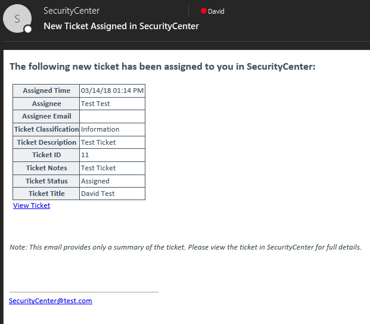
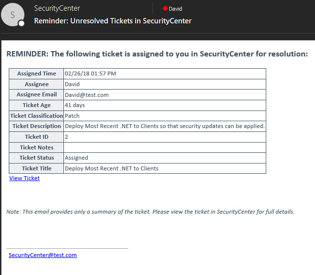

# Ticket Notification Scripts
There are two scripts in this folder that enable an administrator to trigger email notifications to ticket assignees. One of the scripts notifies the ticket assignee when a new ticket has been assigned, and the other notifies the ticket assignee if a ticket is still unresolved after a certain period of time (the default value is 7 days).

# Usage
To use these scripts, they are intended to be run via cronjob. Ofcourse, you could manually trigger them if you wanted. For the cronjob, however, it's important to keep your cronjob frequency in line with the query in the scripts. For example, the NewlyAssignedTickets script is set to look back 30 minutes to see if a ticket was assigned within the last 30 minutes, so you wouldn't want the cronjob to run every 45 minutes, or there would be a gap of 15 minutes in which a new ticket may have been missed.

### For the NewlyAssignedTickets script, a good start is this:
This will run the script every day, at every hour at the :00 and :30 minute marks.

`0,30 * * * * /usr/local/bin/python2.7 /opt/Email-NewlyAssignedTickets.py`

### For the UnresolvedTickets script, a good start is this:
This will run the script every Monday at 10 a.m.

`0 10 * * 1 /usr/local/bin/python2.7 /opt/Email-UnresolvedTickets.py`

# Example Emails
### NewlyAssignedTickets Script

### UnresolvedTickets Script

